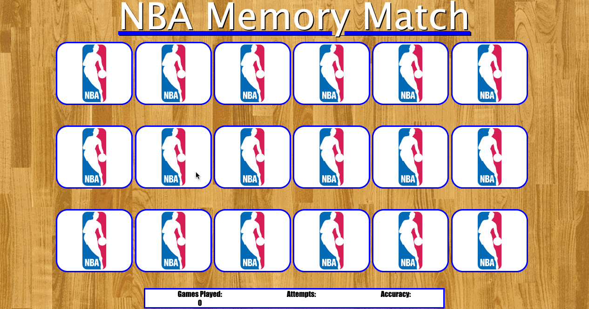

# NBA Match

A full stack NBA themed memory match game where the user tries to match two like cards. In game statistics are updated live, and user can input their scores into a high scores table.


## Technologies Used
- Javascript
- jQuery
- PHP
- MySQL
- HTML5
- CSS3

## Live Demo
Try the game live at [nbamatch.johndedios.net](https://nbamatch.johndedios.net)

## Preview


## Initial Setup
1. Clone this repository into your terminal
     ```shell
    git clone https://github.com/Johndedios94/NBA-match.git
    ```
2. Navigate into the nba_match directory
3. Open the index.html file in your default browser and start playing!
